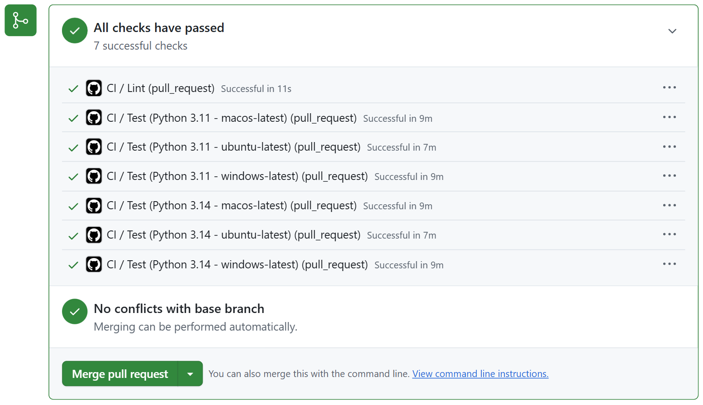

# Hello!

I am Anvika, an undergrad at Caltech studying electrical engineering. I'm particularly interested in biomedical engineering, physics, high-performance computing, and where they intersect. This summer, I participated in Google Summer of Code 2026 under JuliaHealth.

I developed <a href="https://github.com/JuliaHealth/komamripy" target="_blank" style="color: inherit; text-decoration: none;"><code style="color: #7a1eba;">komamripy</code></a>: a Python wrapper for KomaMRI.jl, a GPU-accelerated MRI simulation platform.

> The `komamripy` package lives at [**JuliaHealth/komamripy**](https://github.com/JuliaHealth/komamripy) and [PyPI](https://pypi.org/project/komamripy/).  
> You can connect with me on [GitHub](https://github.com/anvika-singhal) or [LinkedIn](https://www.linkedin.com/in/anvika-singhal/).

In this post, I'll summarize everything I accomplished over the course of this program. I would also like to go over some motivations behind key decisions, things I learned, and the parts that are still in progress.

# What is KomaMRI?

[KomaMRI.jl](https://github.com/JuliaHealth/KomaMRI.jl) is an open-source Julia package for simulating Magnetic Resonance Imaging (MRI) acquisitions.

KomaMRI generates simulated raw MRI data by numerically solving the Bloch equations that describe how the magnetization of a nucleus changes when magnetic fields are applied. Researchers can use it to test pulse sequences/reconstruction algorithms that they have designed. Importantly, it is not dependent on access to a physical scanner, a possibly time-consuming and expensive limitation. The package also supports GPU backend acceleration (CUDA, AMDGPU, Metal, and oneAPI) and comes with a graphical user interface in addition to a flexible programmatic API.

# Why komamripy?

KomaMRI.jl is built entirely in Julia. However, most modern scientific computing and machine learning workflows are built in Python using tools like NumPy, JAX, and PyTorch. It is not currently convenient or accessible to integrate KomaMRI's strength in simulation with a Python pipeline.

`komamripy` bridges this gap between Julia and Python by exposing KomaMRI's core API to Python users through a thin wrapper. This makes it so that a simulation that would normally look like this in Julia:

```julia
# Julia
using KomaMRI
using CUDA

sys = Scanner()
obj = brain_phantom2D()
seq = PulseDesigner.EPI_example()
raw = simulate(obj, seq, sys)
```

can be run like this in Python:

```python
# Python
import komamripy as km
km.load_cuda()

sys = km.Scanner()
obj = km.brain_phantom2D()
seq = km.PulseDesigner.EPI_example()
raw = km.simulate(obj, seq, sys)
```

The syntax is mirrored almost exactly 1:1 making usage as straightforward as possible.

# Goal 1: A pip-installable Package, Built to Modern Python Standards

The first goal was to ship an installable Python package built to best Python practices.

> [JuliaHealth/komamripy/pull/1](https://github.com/JuliaHealth/komamripy/pull/1)  
> [JuliaHealth/komamripy/pull/3](https://github.com/JuliaHealth/komamripy/pull/3)  
> [JuliaHealth/komamripy/pull/4](https://github.com/JuliaHealth/komamripy/pull/4)  
> [JuliaHealth/komamripy/pull/5](https://github.com/JuliaHealth/komamripy/pull/5)  
> [JuliaHealth/komamripy/pull/10](https://github.com/JuliaHealth/komamripy/pull/10)  
> [JuliaHealth/komamripy/pull/14](https://github.com/JuliaHealth/komamripy/pull/14)

## Package Structure

```
komamripy/
├── .github/
│   ├── dependabot.yml
│   └── workflows/
│       ├── ci.yml                   # Test matrix: Linux, macOS, Windows × Python 3.11, 3.14
│       ├── publish.yml              # Build and publish to PyPI triggered by tag push
│       ├── tag_release.yml          # Create git tag when auto-bump PR is merged
│       └── update_deps.yml          # Weekly: resolve KomaMRI versions, open auto-bump PR
├── examples/
│   ├── basic_simulation.py          # End-to-end EPI simulation with brain phantom
│   ├── custom_phantom_creation.py   # Build phantom from NumPy arrays, save/load, simulate
│   ├── gpu_backend_selection.py     # Simple simulation with GPU backend loaded
│   ├── motion_artifact.py           # Rigid-body motion simulation and artifact comparison
│   └── pypulseq_composability.py    # Pulseq sequence full round-trip I/O
├── scripts/
│   └── update_deps.py               # Resolve KomaMRI versions, update juliapkg.json
├── src/
│   └── komamripy/
│       ├── __init__.py              # Mirror-based API: forwards attribute access to KomaMRI
│       ├── _backends.py             # Load GPU backend functionality
│       ├── _session.py              # Lazy Julia session: loads Julia and KomaMRI on first use
│       └── juliapkg.json            # Pinned Julia and KomaMRI dependency declarations
├── tests/
│   ├── smoke_test.py                # Fast checks that don't require a Julia session
│   └── test_integration_examples.py # End-to-end tests, one per example script
├── pyproject.toml                   # Package metadata, dependencies, uv and ruff configuration
└── README.md
```

A modern Python package has a standard set of tools, and `komamripy` uses all of them:

- `pyproject.toml` - single config file for the entire package with metadata, dependencies, build system, and linting rules all in one place.
- `uv` - fast, reproducible environment + dependency management. Consolidate pip, virtualenv, and pip-tools into a single tool.
- `ruff` - linting and formatting. Enforces consistent code style and catches common errors on every commit.
- GitHub Actions - automated testing on every pull request across Linux, macOS, and Windows, automated package updates and deployment.

## API Design

`komamripy` is centered around a mirror-based API which is implemented in `__init__.py`. Specifically, a module-level `__getattr__` pushes any attribute access directly to the Julia-side `KomaMRI` namespace using JuliaCall which is what enables the transparent Julia-Python translation. Also, subpackages such as `KomaMRICore` and `PulseDesigner` are resolved through a `seval` fallback.

The Julia session itself is built to be lazy. This means that Julia and KomaMRI are only loaded on first use so importing `komamripy` does not have the Julia startup cost. Instead, the cost only present when a function is actually called.

Julia dependencies, specifically KomaMRI and its subpackages, are declared in `juliapkg.json` and installed automatically by JuliaCall on first import. Users do not need any seperate Julia install nor do they need to manage their own Julia environment, making the package accesible to users without any Julia experience whatsoever.

## Getting CI Working

Getting thorough tests to pass reliably across all platforms ended up being a technically tricky part of this goal. One key issue ended up being Julia version selection. JuliaCall would select the runner's preinstalled Julia on CI, but on some platforms this hit OpenSSL and embed-path failures. The fix was to pin the Julia version declaratively in `juliapkg.json` (to `~1.10` LTS), mimicing the approach that other Julia-from-Python wrappers like PySR use. Other than CI, this pin also serves to protect end users.

In the end, Python support was set to be `>=3.11` after running a full diagnostic matrix. Python 3.10 fails on Windows with uv-managed Python due to OpenSSL issues, while 3.11 through 3.14 pass across all platforms. The final CI matrix runs Python 3.11 and 3.14 on Ubuntu, macOS, and Windows plus a lint job for a total 7 jobs per run.

 

## Automated Release Pipeline

Keeping Julia dependency versions up to date manually is error-prone and time consuming. `komamripy` has a fully automated weekly pipeline:

1. A scheduled GitHub Action runs `scripts/update_deps.py` which uses Julia's Pkg resolver to check for new compatible versions of KomaMRI and its subpackages.
2. If available versions are different from those currently pinned in `komamripy`, it opens a PR titled `[auto] Bump to version X.X.X` with the changes to the pins and internal version declaration.
3. Once CI passes, the PR auto-merges. If CI fails, the process holds at PR for review.
4. A separate workflow detects the merge, creates a git tag, and pushes it.
5. The tag push triggers the publish workflow which builds and publishes to PyPI.

The result is that `komamripy` tracks KomaMRI releases automatically with no manual steps needed on the happy path.

# Goal 2: Precompilation to reduce First-Use Latency

Julia has a known first call latency since the first time a function is called in a fresh Julia session, it must be compiled from source. For a package like KomaMRI, this can mean waiting tens of seconds before the first simulation runs. This latency trickles down to `komamripy` as well.

The fix is precompilation using [PrecompileTools.jl](https://github.com/JuliaLang/PrecompileTools.jl). During package installation, Julia compiles the specified workloads and caches the bytecode. Loads that follow show significantly reduced compilation and run time.

> [JuliaHealth/KomaMRI.jl/pull/820](https://github.com/JuliaHealth/KomaMRI.jl/pull/820)  
> [JuliaHealth/KomaMRI.jl/pull/929](https://github.com/JuliaHealth/KomaMRI.jl/pull/929)

I added precompilation workloads across three KomaMRI subpackages:

- **KomaMRIBase**: `Scanner`, `Phantom`, `Sequence` (with all event types: RF, gradients, ADC, Delay), motion attachment, `PulseDesigner.EPI_example`, `brain_phantom2D`
- **KomaMRICore**: `simulate()` with all simulation methods (Bloch, BlochDict), Float32 and Float64 variants, all export formats (mat, raw), sequence discretization
- **KomaMRIFiles**: Pulseq sequence read/write, phantom file I/O (read/write roundtrip)

The functions that would most benefit from precompilation were chosen by looking at how frequency they appear across the KomaMRI docs, a proxy for how often each function in used in typical user workflows:

| Function | Docs mentions | Precompiled | Subpackage |
|---|---|---|---|
| `Sequence` | 178 | all event types | Base |
| `Phantom` | 110 | built-in + custom | Base |
| `PulseDesigner` | 58 | `EPI_example` | Base |
| `Scanner` | 38 | constructor | Base |
| `simulate` | 22 | all methods/types | Core |
| `write_seq` | 10 | with all events | Files |
| `read_seq` | 7 | with all events | Files |
| `EPI_example` | 9 | via PulseDesigner | Base |
| `brain_phantom2D` | 8 | built-in | Core |
| `read/write_phantom` | 8 | I/O roundtrip | Files |

Workloads use a simple 1-2 spin phantom to keep precompilation relatively fast. They are placed in the subpackage that defines each function instead of being centralized in the top-level KomaMRI.jl. This helps make sure that they have the correct dependency order (Base -> Core -> Files).

## Benchmarks

The script used for benchmarking runs each of the 10 functions 10x in separate Python subprocesses so that every run has the full Julia cold-start cost. Average run times are then compared before and after precompilation.

{fig-align="center" width="80%"}

>NOTE: the precompilation workload focuses on the most common sequence types, but real pulse sequences are highly dynamic. It is probable that some combinations are not addressed by precompilation. A good portion of `simulate()` time may also be spent in `discretize()`. This may be an area for future optimization.

# Goal 3: GPU Backend Selection
 
In KomaMRI.jl, GPU backends are not loaded by default. A user can enable GPU acceleration by explicitly loading a backend package in Julia. For example, `using CUDA` alongside `using KomaMRI` triggers a package extension that defines methods like `gpu()` for converting arrays to device-specific types (`CuArray` for CUDA, `ROCArray` for AMDGPU, etc.). The actual simulation code is not GPU dependent and will run unedited, no matter the backend.

> [JuliaHealth/komamripy/pull/23](https://github.com/JuliaHealth/komamripy/pull/23)

`komamripy` mirrors this system exactly in `_backends.py` by creating a function to expose each backend:

```python
import komamripy as km

# Load a GPU backend before simulating
km.load_cuda()    # equivalent to `using CUDA` in Julia
# km.load_metal()   # Apple Silicon
# km.load_amdgpu()  # AMD GPUs
# km.load_oneapi()  # Intel GPUs

# Simulation runs on GPU automatically
raw = km.simulate(obj, seq, sys)
```

Each function calls `jl.seval()` to load the corresponding Julia package into the active Julia session enabling GPU dispatch. No other management is needed on either the Python or Julia side, again keeping the user experience streamlined.

The `gpu_backend_selection.py` lets users try simulations run on CPU by default (no backend loading), and that switching backends only involves a single import change and no changes to the following code.

# Goal 2 (continued): Examples and Feature Tests

Alongside the basic package scaffolding and functionality, a number of end-to-end examples were added to demonstrate the core `komamripy` workflows.

> [JuliaHealth/komamripy/pull/12](https://github.com/JuliaHealth/komamripy/pull/12)

These examples are as follows:

- `basic_simulation.py`: Run a simple EPI simulation with the built-in brain phantom, returning a NumPy signal array.
- `pypulseq_composability.py`: Create a KomaMRI-compatible sequence with pypulseq, write it to `.seq` format, read it back with KomaMRI, and verify the round-trip.
- `custom_phantom_creation.py`: Build a custom 2-tissue phantom from NumPy arrays, save and load `.phantom` files, combine phantoms, and simulate.
- `motion_artifact.py`: Attach rigid-body motion to a phantom and simulate w/ and w/o motion, showing how motion-induced artifacts turn up in the raw signal.

Each example has a linked integration test in `tests/test_integration_examples.py` that checks that it runs without errors and generates the expected output.

# Goal 4: JAX Integration - Research and Proof of Concept

The final goal was to explore differentiable MRI simulation from Pytho. Specifically, we were hoping to determine whether KomaMRI's Julia-based autodiff capabilities could be exposed to JAX, allowing gradient-based RF pulse optimization in Python.

To begin, this necesitated researching bidirectional interoperability between JAX and Julia using [Reactant.jl](https://github.com/EnzymeAD/Reactant.jl), which can compile Julia code to [StableHLO](https://github.com/openxla/stablehlo) which is the same intermediate representation JAX uses internally. A proof-of-concept repository ([reactant-jax-poc](https://github.com/anvika-singhal/reactant-jax-poc)) was built to clearly validate and demonstrate three possible branches of interoperability:

> [anvika-singhal/reactant-jax-poc](https://github.com/anvika-singhal/reactant-jax-poc)

**Direction 1: Julia -> JAX**

A Julia function is compiled to StableHLO via Reactant.jl, then executed and differentiated from Python using EnzymeJAX's `hlo_call`. This direction works and produces correct gradients. There is one known issue in that Reactant currently emits `tf.aliasing_output` annotations in the StableHLO that break EnzymeJAX's VJP. The current workaround patches the MLIR string before calling `hlo_call`, which would be fragile for more complex functions. This needs a fix upstream in Reactant.jl or Enzyme-JAX or something similar.

**Direction 2: JAX -> Julia**

A JAX function defined fully in Python is called and differentiated from Julia via `Reactant.@jit` and `Enzyme.gradient`. This direction works cleanly and correct gradients were verified against known values.

**Direction 3: JAX MLP training loop in Julia**

A 2-layer MLP defined in JAX (input:4 → hidden:8 tanh → output:2) is trained from Julia using Enzyme gradients. The gradient computation and weight update are pushed into a single `@compiled` function. This means that weights remain on-device, and the loss was demonstrated to decrease correctly over training steps:

```
Step  1 loss = 0.443342
Step  5 loss = 0.365651
Step 10 loss = 0.283788
Step 15 loss = 0.216205
Step 20 loss = 0.161262
```

The infrastructure demonstrated here is exciting! If the `tf.aliasing_output` issue is resolved, the full bidirectional autodiff channel between JAX and KomaMRI would be very close to complete. This proof-of-concept makes it clear that the approach is sound. One platform cavaet is that Linux x86_64 or macOS ARM64 is currently required due to `enzyme-ad` wheel availability.

# Conclusions and Future Work

Over the course of GSoC 2026, `komamripy` went from just an idea to a pip-installable Python package with:

- A mirror-based Python API that exposes the KomaMRI Julia API cleanly
- Cross-platform CI (Linux, macOS, Windows) with automated weekly dependency updates and PyPI publishing
- CPU and GPU precompilation in KomaMRI.jl, measurably reducing first-use latency in `komamripy`
- GPU backend selection mirroring KomaMRI.jl's package extension system
- End-to-end examples covering simulation, Pulseq I/O, custom phantoms, and motion artifacts
- A proof-of-concept for bidirectional JAX-Julia automatic differentiation

Remaining work includes resolving the `tf.aliasing_output` issue in Direction 1 of the JAX integration, building the full differentiable RF optimization example once that is fixed, and possibly exploring multi-GPU simulation examples.

# Acknowledgements

Thank you to my mentor Carlos Castillo Passi, who provided neverending patience and guidance throughout the summer. I would also like to thank Daniel Ennis and Jakub Mitura for their support.
