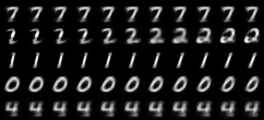
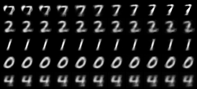

# Hello Everyone! 👋

I am Bhavya, and this summer I participated in Google Summer of Code 2026 with JuliaHealth. My project, **[MedCapsNet.jl](https://github.com/BhavyaQuantDeveloper/MedCapsNet)**, is a from-scratch Julia and [Flux.jl](https://fluxml.ai) reproduction of *Capsule Networks against Medical Imaging Data Challenges* by Jiménez-Sánchez, Albarqouni and Mateus ([LABELS@MICCAI 2018](https://arxiv.org/abs/1807.07559)).

The question behind that paper is one that anyone working with medical images runs into eventually. Annotated medical data is expensive. Datasets are small, the pathological classes you care about most are the rarest, and every label costs an expert's time. The paper asks whether capsule networks, an architecture designed to be equivariant by construction, cope with these constraints better than ordinary convolutional networks do. My job this summer was to rebuild their entire experimental setup in Julia and see whether the story holds up.

> The code lives at [**BhavyaQuantDeveloper/MedCapsNet**](https://github.com/BhavyaQuantDeveloper/MedCapsNet), and the full project page with every figure below is at [**bhavyaquantdeveloper.github.io/MedCapsNet**](https://bhavyaquantdeveloper.github.io/MedCapsNet/).

In this post I want to walk through the ideas, the results, and the parts of the journey that surprised me. Reproducing someone else's research turns out to be a research project of its own.

# Why capsule networks for medical imaging?

Capsule networks come from Sabour, Frosst and Hinton's NeurIPS 2017 paper ([Dynamic Routing Between Capsules](https://arxiv.org/abs/1710.09829)). The core idea is to replace scalar neurons with small vectors called capsules. The length of a capsule's output encodes the probability that some entity is present in the image, and its orientation encodes the pose of that entity: position, scale, stroke thickness, skew. Where a CNN throws away spatial relationships through max pooling, a capsule layer negotiates them. Each lower capsule sends its output to the higher capsule whose prediction it agrees with, a procedure called routing by agreement.

For medical imaging this promises something concrete: a smaller appetite for data. If the network already understands that a rotated lesion is the same lesion, it should not need thousands of augmented examples to learn that fact.

The original study tested this claim carefully. It compared CapsNet against LeNet and against the deliberately strong CNN baseline from the capsule paper, on four datasets (MNIST, Fashion-MNIST, TUPAC16 mitosis detection, and DIARETDB1 diabetic retinopathy), under three controlled stressors:

1. **Limited data**: train on stratified fractions of the training set.
2. **Class imbalance**: starve selected classes down to 20% of their examples.
3. **Data augmentation**: append small rotations, and flips where they make sense.

Their finding was that capsule networks degrade more gracefully than both CNNs as data shrinks or skews. That is the claim my reproduction set out to test.

# The architecture


A capsule's activation is kept inside the unit ball by the squash nonlinearity, which preserves orientation while mapping length into $[0,1)$:

$$ \mathbf{v}_j = \frac{\lVert \mathbf{s}_j \rVert^2}{1+\lVert \mathbf{s}_j \rVert^2}\,\frac{\mathbf{s}_j}{\lVert \mathbf{s}_j \rVert} $$

Each primary capsule $i$ predicts every class capsule $j$ through a learned transform, $\hat{\mathbf{u}}_{j|i} = \mathbf{W}_{ij}\,\mathbf{u}_i$, and routing by agreement decides how much each prediction counts. With logits $b_{ij}$ initialized to zero, three iterations of:

$$ c_{ij} = \operatorname{softmax}_j(b_{ij}), \quad \mathbf{s}_j = \sum_i c_{ij}\,\hat{\mathbf{u}}_{j|i}, \quad \mathbf{v}_j = \operatorname{squash}(\mathbf{s}_j), \quad b_{ij} \mathrel{+}= \hat{\mathbf{u}}_{j|i}\cdot\mathbf{v}_j $$

Training uses the margin loss ($m^+{=}\,0.9$, $m^-{=}\,0.1$, $\lambda{=}\,0.5$) plus a small reconstruction term weighted by $\alpha = 5\times10^{-4}$, so the decoder regularizes the encoder without dominating it:

$$ L_k = T_k\,\max(0,\, m^+ - \lVert \mathbf{v}_k \rVert)^2 + \lambda\,(1-T_k)\,\max(0,\, \lVert \mathbf{v}_k \rVert - m^-)^2, \qquad \mathcal{L} = \sum_k L_k + \alpha \,\lVert \hat{\mathbf{x}} - \mathbf{x} \rVert^2 $$

I treated every number in the reference implementation as normative and copied it exactly, asserting it in tests wherever a test could reach it:

| Component | Value (identical to the reference) |
| --- | --- |
| Convolutions | 256 filters, 9×9, valid, ReLU; stride 1 then stride 2 |
| Primary capsules | 1152 capsules of 8 dimensions, squash |
| Class capsules | $n$ capsules of 16 dimensions |
| Routing | 3 iterations, softmax over classes |
| Decoder | Dense 16·$n$ → 512 → 1024 → 784 |
| Loss | margin ($0.9/0.1/0.5$) plus $5{\times}10^{-4}$ times reconstruction error |
| Optimizer | Adam, learning rate $10^{-3}$, times 0.95 each epoch |
| Batch size | 64 (CapsNet), 128 (CNNs) |

The two comparison networks matter as much as CapsNet itself. LeNet is the small classic, exactly 61,706 trainable parameters, and the test suite asserts that count. The Baseline CNN is the deliberately strong one from the capsule paper, roughly 25 million parameters against CapsNet's 8 million. That asymmetry is the point: if CapsNet still wins in the low data regime, it is not because it has more capacity.

# Stressing the data

The heart of the study is a harness that damages the training data in controlled ways. Each stressor is a pure function that takes a labeled dataset and returns a new one, with an explicit random number generator so every run is reproducible:

```julia
# keep a stratified 10% of every class
train = limit_data(train, 10; rng)

# starve two chosen classes down to 20% of their examples
train = unbalance_data(train, [1, 9], 20; rng)

# append rotated copies of 5% of the samples
train = augment_data(train; flips=false, rng)
```

These sound trivial to implement, and they almost are, which is exactly why they are dangerous. The details are easy to get subtly wrong: the limited data subsample has to be stratified per class, and augmentation has to append copies rather than replace originals. I mirrored the reference's behavior on each of these points and wrote tests around them.

# What reimplementation taught me

I built the port test first, in small reviewed steps, and the suite grew to 64 assertions. Not just shape checks: hand computed loss values, a property test that capsules voting coherently for a class must beat incoherent votes, a checkpoint round trip that must reproduce the best validation loss exactly, and a synthetic stained image that must separate its two dyes. Those tests earned their keep, because reproducing a paper turns out to be a very effective way of reviewing it, and of reviewing yourself.

Three stories stand out.

**The stain separation bug.** The medical histology pipeline needs stain normalization, and since the sparse dictionary method the reference used has no Julia equivalent, I substituted the standard Macenko method, which separates stains with an SVD on optical densities. My first draft picked the hematoxylin stain vector as the one with the larger blue component. That is the intuitive choice, since hematoxylin is the blue-purple stain. It is also wrong. Hematoxylin looks blue because it absorbs red light, and on normalized optical density vectors the comparison inverts, so my code was selecting eosin instead. A test on a synthetic stained image failed, I re-derived the optics to understand why, and the fix is what standard Macenko implementations actually do: compare the red component. No shape check would ever have caught this. The lesson stayed with me for the rest of the summer: test the semantics, not the dimensions.

**The flaky test.** One test asked a simple question, "does the trainer learn?", and failed roughly one run in three. The cause was a single layer drawing its initial weights from the global random number generator while everything else was carefully seeded. Fixing the seed made the suite deterministic, and then revealed something more interesting: about a quarter of all seeds genuinely fail the assertion that five epochs are enough to learn a tiny toy problem. Reproducibility bugs love to hide behind assertions that are merely usually true.

**Memory layouts lie politely.** The reference code, written in TensorFlow, reshapes its convolutional output so that groups of 8 consecutive channels at one spatial position become capsules. Julia stores arrays in a different memory order, so the same reshape produces valid shapes, trains without complaint, and quietly means something different. Getting the equivalent grouping right required a permutation before the reshape, and verifying it required sitting down with the index algebra by hand. A network that is wrong in this particular way still learns reasonably well, which is precisely what makes the mistake so easy to ship.

There was also a small pile of ordinary defects found by review or by failing builds before they could do harm: a results file format that embedded a comma inside a comma separated file, compatibility bounds that silently raised the minimum Julia version, an initialization order that could not compile. None of these are glamorous. All of them are the actual texture of reproduction work.

# Results

The low data regime is where the paper's claim lives, so that is what I swept: both architectures trained on 1%, 5%, and 10% of MNIST for 10 epochs with the exact optimizer schedule above, evaluated on the untouched test set of 10,000 images.


| Configuration | Training images | CapsNet | LeNet |
| --- | --- | --- | --- |
| 1% of MNIST | 550 | **91.55%** | 83.45% |
| 5% of MNIST | 2,750 | **97.70%** | 93.70% |
| 10% of MNIST | 5,501 | **98.51%** | 96.07% |
| 100% of MNIST | 55,000 | not run | 98.75% |
| Imbalance (two digits at 20%) | 46,364 | not run | 98.73% |
| Augmented | 57,750 | not run | 98.92% |

The "not run" entries are honest budget lines rather than gaps in the port. A full data CapsNet run costs about ten times the 10% run, and the harness runs every one of these configurations with a single command line flag, so anyone with the compute can fill the table in.


My favorite result is also the least quantitative one. If you take the winning capsule, nudge one of its 16 dimensions, and decode each nudged version, you can watch what that dimension learned to represent:





# How the numbers compare to the paper's

The reference study trained 432 networks in total: 3 architectures, 9 data conditions, 4 repetitions, 4 datasets, 50 epochs with early stopping, reporting mean F1 scores. My runs are a much smaller budget, a single seed for 10 epochs reporting accuracy, so the honest comparison is of trends rather than of individual cells:

| MNIST fraction | LeNet, paper (F1) | CapsNet, paper (F1) | LeNet, this port (acc.) | CapsNet, this port (acc.) |
| --- | --- | --- | --- | --- |
| 1% | 0.909 | **0.943** | 83.45% | **91.55%** |
| 5% | 0.961 | **0.975** | 93.70% | **97.70%** |
| 10% | 0.975 | **0.985** | 96.07% | **98.51%** |

*The paper columns are mean F1 over 4 repetitions from the original TensorFlow implementation, Table 2 of [arXiv:1807.07559](https://arxiv.org/abs/1807.07559). The port columns are single seed test accuracy from the Julia code. Different metric, different budget: compare the shape, not the cells.*

Both halves of the table tell the same story. CapsNet leads at every fraction, and the lead is largest where data is scarcest, shrinking steadily as data grows. The port's gaps are wider than the paper's, which makes sense: ten epochs punish a CNN's appetite for data harder than fifty epochs with early stopping do.

For the full picture, here is the original study's own summary of its findings. **These are the reference TensorFlow results, not outputs of this port** (figure by Jiménez-Sánchez et al., reproduced from the [reference repository](https://github.com/ameliajimenez/capsule-networks-medical-data-challenges), MIT License):


On the medical datasets, the ones this port's pipelines are pointed at, the paper reports the same graceful degradation. On DIARETDB1, CapsNet beats both CNNs at every training fraction. On TUPAC16 it trails LeNet at 1%, draws level at 5%, and leads from 10% up. It is also the most robust of the three to class imbalance on both medical datasets. Those tables are the yardstick my medical runs will be measured against.

# The medical pipelines


Both medical datasets from the study are supported end to end, and the difficulty of even obtaining them today is the paper's thesis writing itself. The original DIARETDB1 host, a 2007 era university server, is offline. The one public mirror labeled DIARETDB1 actually contains its predecessor, DIARETDB0. TUPAC16 sits behind challenge registration. The figure above therefore demonstrates the pipeline on a DIARETDB0 image, taken with the same camera under the same protocol, and the training recipe runs unchanged the moment the real dataset lands.

For mitosis detection, histology tiles are stain normalized with Macenko, the hematoxylin channel is extracted, and patches are cut around annotated mitosis centers with jittered positives and grid sampled negatives. For diabetic retinopathy, fundus images are cropped, contrast enhanced, reduced to the green channel, and patches are extracted at lesion centers, exudates versus hemorrhages. Both pipelines write the same data contract that the trainer consumes, so a medical run is just a preprocessing script followed by the ordinary train and test commands.

The one documented algorithmic deviation of the whole port lives here: the reference normalizes stains with the Vahadane method through a library that has no Julia equivalent, so this port uses Macenko, which is the standard substitute.

# A detour: training on Apple GPUs

Late in the summer I ported the training loop to Apple Silicon GPUs through [Metal.jl](https://github.com/JuliaGPU/Metal.jl), and the detour earned its place in this post because the negative results were as instructive as the wins.

The naive port lost to the CPU. Translating the reference code directly produces a capsule layer built from one huge broadcast, and the backward pass through a 380 MB temporary array turns into kernel launch soup: 2,840 ms per gradient step on the GPU against 1,425 ms on the CPU.

The fix was to notice that the capsule prediction step is exactly a batched matrix multiplication. Expressed that way, it hits Apple's optimized matmul kernels on the GPU and BLAS on the CPU. The CPU step time dropped about 40% and the GPU finally pulled ahead per step, verified across five independent benchmark runs.

Then the operating system killed my training run. Multi epoch GPU training ballooned to 62.8 GB of unified memory on a 24 GB machine before macOS stepped in. Half of the cause is a known ecosystem trap: Julia's garbage collector never feels GPU buffer pressure, which a periodic reclaim in the trainer fixes. The other half, isolated by running each layer alone while sampling memory, is a genuine buffer leak inside Metal.jl's batched matmul, the exact operation the speedup relies on, and no amount of garbage collection can reclaim it.

So the honest state of GPU support: the two CNNs train fully on the GPU with bounded memory, and the LeNet results above were produced that way. CapsNet training stays on the CPU until the upstream leak is fixed, which the matmul reformulation made perfectly practical at about 15 minutes for the 10% data model. Every measurement and the bisection procedure ship with the repository.

# Reproducing this work

Everything in this post comes from runs of the Julia code, and the repository is set up so you can check that claim:

```bash
git clone https://github.com/BhavyaQuantDeveloper/MedCapsNet && cd MedCapsNet
julia --project=. -e 'using Pkg; Pkg.instantiate(); Pkg.test()'
```

The README documents the commands that regenerate each figure and result above, and a single script sweeps the full experimental grid from the paper for anyone with a few days of compute.

Some honest limitations. These are single seed, 10 epoch runs on MNIST, a demonstration that the reproduced pipeline behaves like the paper's rather than a re-derivation of its tables. The medical datasets need registration gated downloads. And beyond the Macenko substitution, two reference behaviors are approximated and flagged in the README: the contrast enhancement parameters, and the optimizer's decay rate, which the reference leaves unspecified.

# What's next

- Running the full multi seed, 25 epoch sweep across all four datasets once compute allows.
- Chasing the Metal.jl buffer leak upstream so CapsNet training can move to the GPU too.
- Running the medical experiments end to end as soon as the gated downloads land.

# Acknowledgments

Thank you to my mentors and the JuliaHealth community for their guidance and reviews throughout the summer, and to the maintainers of Flux.jl, Zygote.jl, Metal.jl, and MLDatasets.jl, whose work this project builds on.

# References

1. A. Jiménez-Sánchez, S. Albarqouni, D. Mateus. *Capsule Networks against Medical Imaging Data Challenges.* LABELS@MICCAI 2018. [arXiv:1807.07559](https://arxiv.org/abs/1807.07559)
2. S. Sabour, N. Frosst, G. E. Hinton. *Dynamic Routing Between Capsules.* NeurIPS 2017. [arXiv:1710.09829](https://arxiv.org/abs/1710.09829)
3. M. Macenko et al. *A method for normalizing histology slides for quantitative analysis.* ISBI 2009.
4. Reference implementation: [ameliajimenez/capsule-networks-medical-data-challenges](https://github.com/ameliajimenez/capsule-networks-medical-data-challenges) (TensorFlow 1.4).
5. This port: [BhavyaQuantDeveloper/MedCapsNet](https://github.com/BhavyaQuantDeveloper/MedCapsNet) (Julia ≥ 1.10, Flux 0.16).
