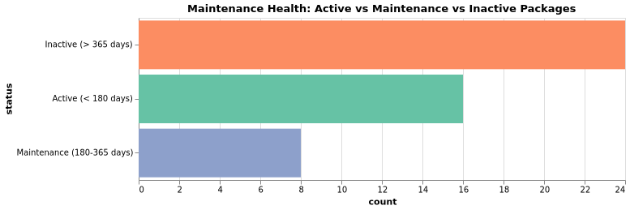
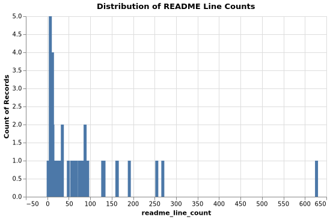

## Introduction

Hi everyone! I'm Kosuri Lakshmi Indu, a final-year undergraduate student majoring in Computer Science and a Google Summer of Code 2025 contributor. Over the past year, I've had the wonderful opportunity to work with the JuliaHealth community, where I've been learning, contributing and getting involved in various projects focused on improving how we work with healthcare data and strengthen our ecosystem.

This blog post is part of my work on a **NumFOCUS Small Development Grant** project focused on [**Improving JuliaHealth Documentation Accessibility for Community Onboarding**](https://github.com/JuliaHealth/JuliaHealth.github.io/issues/59). The grant supports three main goals:

1. Attracting new community members and contributors: by making documentation more accessible and centralized
2. Highlighting JuliaHealth workflows: through practical guides and examples
3. Strengthening community robustness: by improving documentation practices, CI pipelines and package maintenance

## Why This Audit?

As the first phase of this grant work, I conducted a comprehensive audit of the entire JuliaHealth ecosystem. The goal was simple: understand the current state of our org packages so we can identify what's working well and where we need help.

The JuliaHealth organization currently maintains 60 (48 packages + 12 non-package) repositories focused on healthcare, medical imaging, bioinformatics and health data analysis. But without a systematic way to assess all packages, it's impossible to know which ones are well-documented, which have good testing infrastructure and which are actively maintained. So I built an automated audit system to evaluate the entire ecosystem across a set of metrics.

This audit helps us answer important questions:

- How many packages have documentation deployed for users?
- Do packages have contributing guidelines to help newcomers get started?
- Which packages track code coverage to ensure test quality?
- Are packages actively maintained or have some gone quiet? and etc

In this blog post, I'll walk you through what I discovered about the JuliaHealth ecosystem. The work is well documented in repository: [**JuliaHealthAudit**](https://github.com/JuliaHealth/JuliaHealthAudit)

## General Stats

Before diving into detailed findings, let's look at the big picture. This section provides a snapshot of the entire JuliaHealth ecosystem.

### General Registry Status

The General Registry is Julia's central package repository that makes packages easily discoverable and installable via the built-in package manager. Being registered means users can simply run `using PackageName` or `] add PackageName` without needing to know the GitHub URL. Out of 48 packages, **38 are registered** in the General Registry (79%), while **10 remain unregistered** (21%). 

 

**Packages NOT in General Registry (10):**

- Thunderbolt.jl
- PubMedMiner.jl
- CTakesParser.jl
- OMOPCDMFeasibility.jl
- OMOPCDMPathways.jl
- HealthDash.jl
- HealthLLM.jl
- OHDSIAPI.jl
- GitHubAnalytics.jl
- IPUMS.jl
- CloToP.jl

**Packages with Repo Link Mismatches (7):**

- BlindingIndex.jl
- DICOMTree.jl
- MedEval3D.jl
- MedPipe3D.jl
- NCEI.jl
- NeuroAnalyzer.jl
- OMOPVocabMapper.jl

### Archived and Forked Packages

Archived packages are read-only repositories that are no longer actively maintained. Forked packages originate from other repositories and may have development happening elsewhere.

**Archived Packages (2):**

- WrapperITKIO.jl
- ITKIOWrapp.jl

**Forked Packages (1):**

- NCEI.jl

 

### Top Packages by Stars

### Top Packages by Contributors

### Non-Package Repositories

The JuliaHealth organization also hosts **12 non-package repositories** for documentation, tutorials, papers, and infrastructure:

**Note:** The audit identified 10 non-package repositories through the GitHub API. Two additional repositories (juliahealth.github.io and juliahealth.github.io-previews) could not be identified due to API privacy constraints.

## Detailed Findings

Now let's dive deeper into specific aspects of the JuliaHealth ecosystem. This section breaks down the audit findings by categories:

- [Documentation](#documentation)
- [CI/CD & Testing](#ci-cd-testing)
- [Community & Activity](#community-activity)
- [Code Quality & Standards](#code-quality-standards)
- [Package Structure & Maturity](#package-structure-maturity)

### Documentation {#documentation}

Documentation is crucial for package adoption and contribution. We evaluated multiple aspects: whether packages have a docs/ directory, use Documenter.jl, deploy to GitHub Pages, and include contributor guidelines.

#### Documentation Coverage

#### GitHub Pages Deployment
 

Packages without GitHub Pages

- DICOM.jl
- NeuroAnalyzer.jl
- MedEye3d.jl
- MedPipe3D.jl
- DICOMTree.jl
- MedEval3D.jl
- HealthSampleData.jl
- ITKIOWrapper.jl
- OMOPVocabMapper.jl
- BlindingIndex.jl
- NCEI.jl
- PubMedMiner.jl
- CTakesParser.jl
- HealthDash.jl
- HealthLLM.jl
- CloToP.jl
- WrapperITKIO.jl
- ITKIOWrapp.jl
- MTIWrapper.jl

### CI/CD & Testing {#ci-cd-testing}

Continuous Integration and testing infrastructure ensure code quality and catch bugs early. We examined CI adoption, infrastructure choices, code coverage tracking, and testing practices.

#### CI/CD Adoption
 

Packages missing CI workflows

- MedPipe3D.jl
- MedEval3D.jl
- HealthDash.jl
- CloToP.jl
- WrapperITKIO.jl
- ITKIOWrapp.jl

 

#### Non-package repositories missing CI workflows

- MedPipe3DTutorial
- OMOPCDMPredictor
- ObservationalHealthSubecosystemPaper
- JuliaHealthEcosystemPaper
- JuliaHealthZoo

#### CI Status

#### Code Coverage
 

Packages without code coverage configured

- BloodFlowTrixi.jl
- NeuroAnalyzer.jl
- BioMedQuery.jl
- MedEye3d.jl
- ARules.jl
- MedPipe3D.jl
- DICOMTree.jl
- MedEval3D.jl
- ITKIOWrapper.jl
- OMOPCDMDatabaseConnector.jl
- BlindingIndex.jl
- PubMedMiner.jl
- HealthDash.jl
- GitHubAnalytics.jl
- CloToP.jl
- WrapperITKIO.jl
- ITKIOWrapp.jl

### Community & Activity {#community-activity}

Community engagement and maintenance activity indicate package health. We analyzed stars, contributors, issues, pull requests, and maintenance status.

#### Contributors Distribution

#### Stars Distribution

#### Maintenance Health

| Status | Criteria |
|---|---|
| Active | Last push < 180 days |
| Maintenance | Last push 180–365 days |
| Inactive | Last push > 365 days |
| Unknown | Timestamp unavailable or unparsable |

 

#### Issues Comparison

#### Pull Requests Comparison

#### Releases Distribution

#### Non-Package Issues

#### Non-Package Pull Requests

### Code Quality & Standards {#code-quality-standards}

Code quality standards improve maintainability and collaboration. We checked for README quality, style guide adoption, license compliance, and overall standards.

#### README Quality

README quality is assessed by evaluating: (1) presence of code blocks/examples, (2) content length (indicating comprehensiveness), and (3) documentation completeness. These metrics help users quickly understand package functionality and usage.

#### Style Guide Distribution
 

**Packages Following Blue or SciML Style Guides:**

| Package | Style Guide |
|---|---|
| KomaMRI.jl | Blue |
| HealthSampleData.jl | Blue |
| Thunderbolt.jl | SciML |
| OMOPCDMFeasibility.jl | Blue |
| OMOPCDMPathways.jl | Blue |
| HealthLLM.jl | Blue |
| IPUMS.jl | Blue |

 

### Package Structure & Maturity {#package-structure-maturity}

Proper package structure and maturity indicators help users assess reliability. We evaluated standard layout compliance, registry status, archive status, and maturity tiers.

For clarity, in this audit a package is considered to follow the "standard layout" when it meets the required items and all recommended checks below.

- Required items (all required):
  - `has_src_dir`: repository contains a `src/` directory
  - `has_project_toml`: `Project.toml` is present
  - `has_license`: a LICENSE file is present

- Recommended checks (all recommended):
  - `has_test_dir`: `test/` directory exists
  - `has_docs_dir`: `docs/` directory exists
  - `has_ci`: CI workflows exist (e.g., `.github/workflows/`)
  - `uses_documenter`: uses Documenter.jl for docs
  - `code_coverage_config`: code coverage reporting configured (e.g., Codecov)

Packages marked as following the standard layout must satisfy every item in both lists.

#### Structure Compliance

#### Standards Percentages

#### Maturity Tiers

| Tier | Criteria |
|---|---|
| Stable | In General Registry; releases >= 10 |
| Developing | In General Registry; releases >= 1 |
| Early | Not in General Registry OR no releases |

 

## Actionables

Looking at our findings, here are concise, prioritized actions organized in the requested order. Each item is phrased as a small, actionable task that can be addressed in a single PR or issue.

### Documentation

- **Rationale:** Good documentation makes it easy for users to learn and use the package.
  Good docs also help contributors get started and contribute safely.
- **Actions:**
  - Deploy `docs/` to GitHub Pages.
  - Add a short `CONTRIBUTING.md` and a `CODE_OF_CONDUCT.md`.
  - Add a well-defined example and description with a code block to the `README`.
  - Use `Documenter.jl` to build docs when appropriate.

### CI/CD & Testing

 - **Rationale:** CI runs tests automatically to find bugs early.
  Coverage helps identify parts of the code that need more tests.
- **Actions:**
  - Add a GitHub Actions workflow that runs tests and builds docs.
  - Enable coverage reporting and add a coverage badge (codecov) to the `README`.
  - Add `test/` for key functionality.

### Community & Activity

- **Rationale:** Clear labels and simple guides help new contributors find tasks.
  Public maintainer info makes it easier to coordinate work and handoffs.
- **Actions:**
  - Add `good first issue` and `help wanted` labels and link them to `CONTRIBUTING.md`.
  - Add a `MAINTAINERS.md` or contact/triage instructions in the `README`.
  - Open an issue for inactive packages proposing archive, transfer or handoff steps.

### Code Quality & Standards

- **Rationale:** A shared code style reduces trivial review comments and confusion.
  CI checks catch obvious issues before human review.
- **Actions:**
  - Adopt `JuliaFormatter` and add formatting to CI.
  - Add basic lint or build checks to CI (e.g., docs build, tests pass).

### Package Structure & Maturity

- **Rationale:** A standard layout makes packages easier to install and use.
  Published releases let others depend on stable versions.
- **Actions:**
  - Finalize a standard template for package structure.
  - Publish a release and register in the General Registry if ready; fix registry metadata if needed.

Use the generated lists in [data/results/lists](data/results/lists) to pick concrete targets and open issues or PRs against the repositories listed.

## Conclusion

The JuliaHealth ecosystem is growing and has a strong foundation. Most packages follow good practices like CI/CD automation and General Registry registration. We have excellent examples like KomaMRI.jl that show what well-maintained packages look like. But there's room for improvement. Some packages lack documentation, contributing guidelines and code of conduct files. Some valuable packages have become inactive and need new maintainers.

The good news is that every gap we identified is an opportunity to contribute. This audit is just the beginning. The goal is to make JuliaHealth more accessible so new members can easily discover packages, understand how to use them, and contribute improvements.

If you want to get involved, check out the audit repository, browse the detailed findings and pick something you'd like to work on. The JuliaHealth community is friendly and supportive. Reach out on Julia Slack (#health-and-medicine) or Discourse if you have questions. Let's work together to make JuliaHealth even better ❤️.

## Acknowledgements

This work was made possible by the **NumFOCUS Small Development Grant** program. Thank you to NumFOCUS for supporting ecosystem health and community sustainability. Special thanks to my mentors: **Carlos Castillo Passi** and **Jacob Zelko (TheCedarPrince)** - for project guidance, technical mentorship and insights into the JuliaHealth ecosystem

**Thank you to:**

- The **JuliaHealth community** - Over 300 members across Slack, Zulip, and Discourse who make this ecosystem welcoming and collaborative
- All **package maintainers and developers** - For building and maintaining the tools that make this audit possible
- The **Julia community** - For creating an amazing language and ecosystem

_Note: This blog post was drafted with the assistance of LLM technologies to support grammar, clarity and structure._
