## Introduction

Hi everyone! I'm Kosuri Lakshmi Indu, a final-year undergraduate student majoring in Computer Science and a Google Summer of Code 2025 contributor. Over the past year, I've had the wonderful opportunity to work with the JuliaHealth community, where I've been learning, contributing and getting involved in various projects focused on improving how we work with healthcare data and strengthen our ecosystem.

This blog post is part of my work on a **NumFOCUS Small Development Grant** project focused on [**Improving JuliaHealth Documentation Accessibility for Community Onboarding**](https://github.com/JuliaHealth/JuliaHealth.github.io/issues/59). The grant supports three main goals:

1. Attracting new community members and contributors: by making documentation more accessible and centralized
2. Highlighting JuliaHealth workflows: through practical guides and examples
3. Strengthening community robustness: by improving documentation practices, CI pipelines and package maintenance

## Why This Audit?

As the first phase of this grant work, I conducted a comprehensive audit of the entire JuliaHealth ecosystem. The goal was simple: understand the current state of our org packages so we can identify what's working well and where we need help.

The JuliaHealth organization currently maintains 60 (48 packages + 12 non-package) repositories focused on healthcare, medical imaging, bioinformatics and health data analysis. But without a systematic way to assess all packages, it's impossible to know which ones are well-documented, which have good testing infrastructure and which are actively maintained. So I built an automated audit system to evaluate the entire ecosystem across a set of metrics.

This audit helps us answer important questions:

- How many packages have documentation deployed for users?
- Do packages have contributing guidelines to help newcomers get started?
- Which packages track code coverage to ensure test quality?
- Are packages actively maintained or have some gone quiet? and etc

In this blog post, I'll walk you through what I discovered about the JuliaHealth ecosystem. The work is well documented in repository: [**JuliaHealthAudit**](https://github.com/JuliaHealth/JuliaHealthAudit)

## General Stats

Before diving into detailed findings, let's look at the big picture. This section provides a snapshot of the entire JuliaHealth ecosystem.

### General Registry Status

The General Registry is Julia's central package repository that makes packages easily discoverable and installable via the built-in package manager. Being registered means users can simply run `using PackageName` or `] add PackageName` without needing to know the GitHub URL. Out of 48 packages, **34 are registered** in the General Registry (79%), while **14 remain unregistered** (21%). 

 

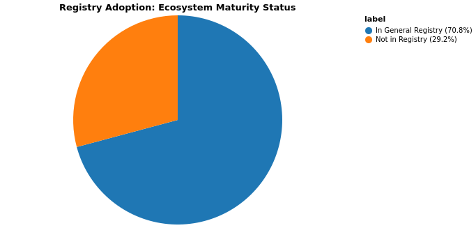

**Packages NOT in General Registry (14):**

- CTakesParser.jl
- CloToP.jl
- GitHubAnalytics.jl
- HealthDash.jl
- HealthLLM.jl
- IPUMS.jl
- ITKIOWrapp.jl
- MTIWrapper.jl
- OHDSIAPI.jl
- OMOPCDMFeasibility.jl
- OMOPCDMPathways.jl
- PubMedMiner.jl
- Thunderbolt.jl
- WrapperITKIO.jl

**Packages with Repo Link Mismatches (7):** What I have noticed is that, even though the repo-link stated is different, it is redirecting to the JuliaHealth page.

- BlindingIndex.jl
- DICOMTree.jl
- MedEval3D.jl
- MedPipe3D.jl
- NCEI.jl
- NeuroAnalyzer.jl
- OMOPVocabMapper.jl

### Archived and Forked Packages

Archived packages are read-only repositories that are no longer actively maintained. Forked packages originate from other repositories and may have development happening elsewhere.

**Archived Packages (2):**

- WrapperITKIO.jl
- ITKIOWrapp.jl

**Forked Packages (1):**

- NCEI.jl

 

### Top Packages by Stars

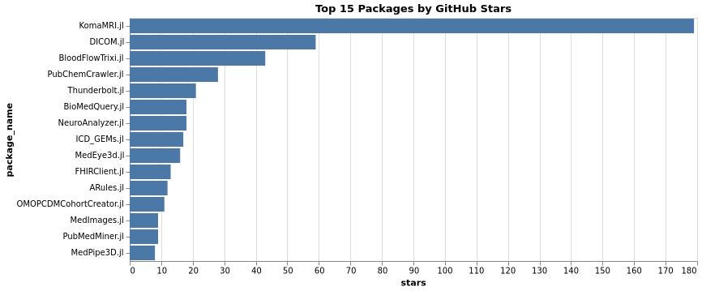

### Top Packages by Contributors

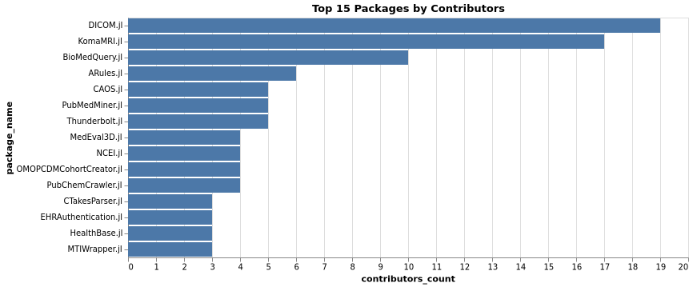

### Non-Package Repositories

The JuliaHealth organization also hosts **12 non-package repositories** for documentation, tutorials, papers, and infrastructure:

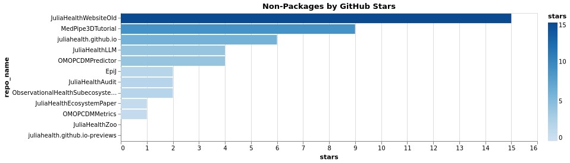

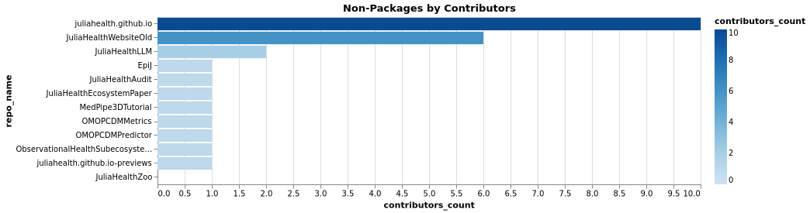

## Detailed Findings

Now let's dive deeper into specific aspects of the JuliaHealth ecosystem. This section breaks down the audit findings by categories:

- [Documentation & README](#documentation-readme)
- [CI/CD, Testing & Coverage](#ci-cd-testing-coverage)
- [Structure, Licensing & Maturity](#structure-licensing-maturity)
- [Activity, Releases & Engagement](#activity-releases-engagement)
- [Issues & PR Health](#issues-pr-health)
- [Contributors (Cross-Ecosystem)](#contributors-cross-ecosystem)

### Documentation & README {#documentation-readme}

Documentation is crucial for package adoption and contribution. We evaluated whether packages have a docs/ directory, use Documenter.jl, deploy to GitHub Pages, and include contributor guidelines.

#### Documentation Coverage

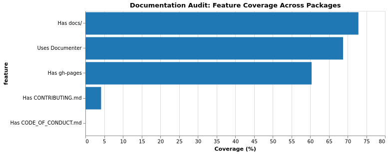

#### GitHub Pages Deployment

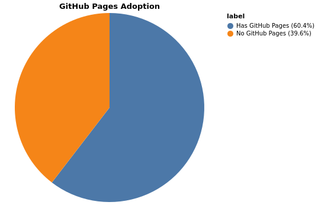

Packages without GitHub Pages

- DICOM.jl
- NeuroAnalyzer.jl
- MedEye3d.jl
- MedPipe3D.jl
- DICOMTree.jl
- MedEval3D.jl
- HealthSampleData.jl
- ITKIOWrapper.jl
- OMOPVocabMapper.jl
- BlindingIndex.jl
- NCEI.jl
- PubMedMiner.jl
- CTakesParser.jl
- HealthDash.jl
- HealthLLM.jl
- CloToP.jl
- WrapperITKIO.jl
- ITKIOWrapp.jl
- MTIWrapper.jl

#### README Completeness

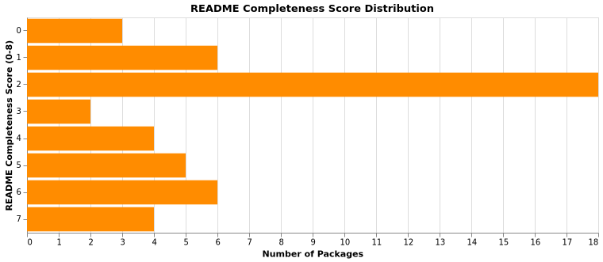

README completeness scoring (0–8), one point each:

- Install/quickstart instructions
- Usage or examples section
- Contributing guidance
- Lists that break up dense text
- Links to docs/issues/community
- Code blocks or inline examples
- Badges (build, coverage, license, etc.)
- Section headers (##) for structure

### CI/CD, Testing & Coverage {#ci-cd-testing-coverage}

Continuous Integration and testing infrastructure ensure code quality and catch bugs early. We examined CI adoption, CI status, code coverage tracking, and testing practices.

#### CI/CD Adoption

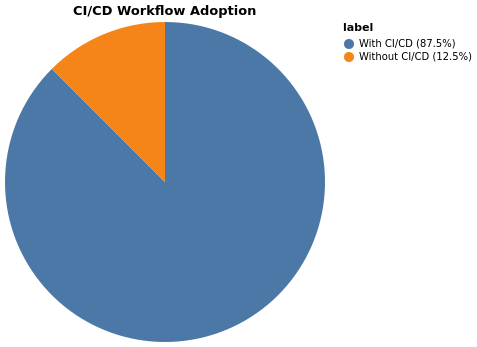

Packages missing CI workflows

- MedPipe3D.jl
- MedEval3D.jl
- HealthDash.jl
- CloToP.jl
- WrapperITKIO.jl
- ITKIOWrapp.jl

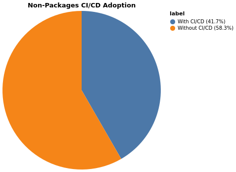

#### Non-package repositories missing CI workflows

- MedPipe3DTutorial
- OMOPCDMPredictor
- ObservationalHealthSubecosystemPaper
- JuliaHealthEcosystemPaper
- JuliaHealthZoo

#### CI Status

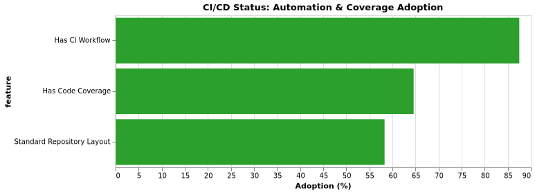

#### Code Coverage

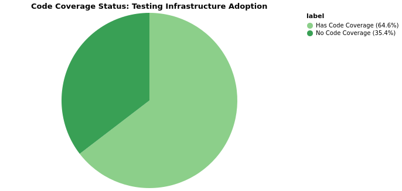

Packages without code coverage configured

- BloodFlowTrixi.jl
- NeuroAnalyzer.jl
- BioMedQuery.jl
- MedEye3d.jl
- ARules.jl
- MedPipe3D.jl
- DICOMTree.jl
- MedEval3D.jl
- ITKIOWrapper.jl
- OMOPCDMDatabaseConnector.jl
- BlindingIndex.jl
- PubMedMiner.jl
- HealthDash.jl
- GitHubAnalytics.jl
- CloToP.jl
- WrapperITKIO.jl
- ITKIOWrapp.jl

### Structure, Licensing & Maturity {#structure-licensing-maturity}

Proper package structure, licensing clarity, and maturity indicators help users assess reliability. We evaluated standard layout compliance, registry status, archive status, maturity tiers, and license coverage.

For clarity, in this audit a package is considered to follow the "standard layout" when it meets the required items and all recommended checks below.

- Required items (all required):
  - `has_src_dir`: repository contains a `src/` directory
  - `has_project_toml`: `Project.toml` is present
  - `has_license`: a LICENSE file is present

- Recommended checks (all recommended):
  - `has_test_dir`: `test/` directory exists
  - `has_docs_dir`: `docs/` directory exists
  - `has_ci`: CI workflows exist (e.g., `.github/workflows/`)
  - `uses_documenter`: uses Documenter.jl for docs
  - `code_coverage_config`: code coverage reporting configured (e.g., Codecov)

Packages marked as following the standard layout must satisfy every item in both lists.

#### Structure Compliance

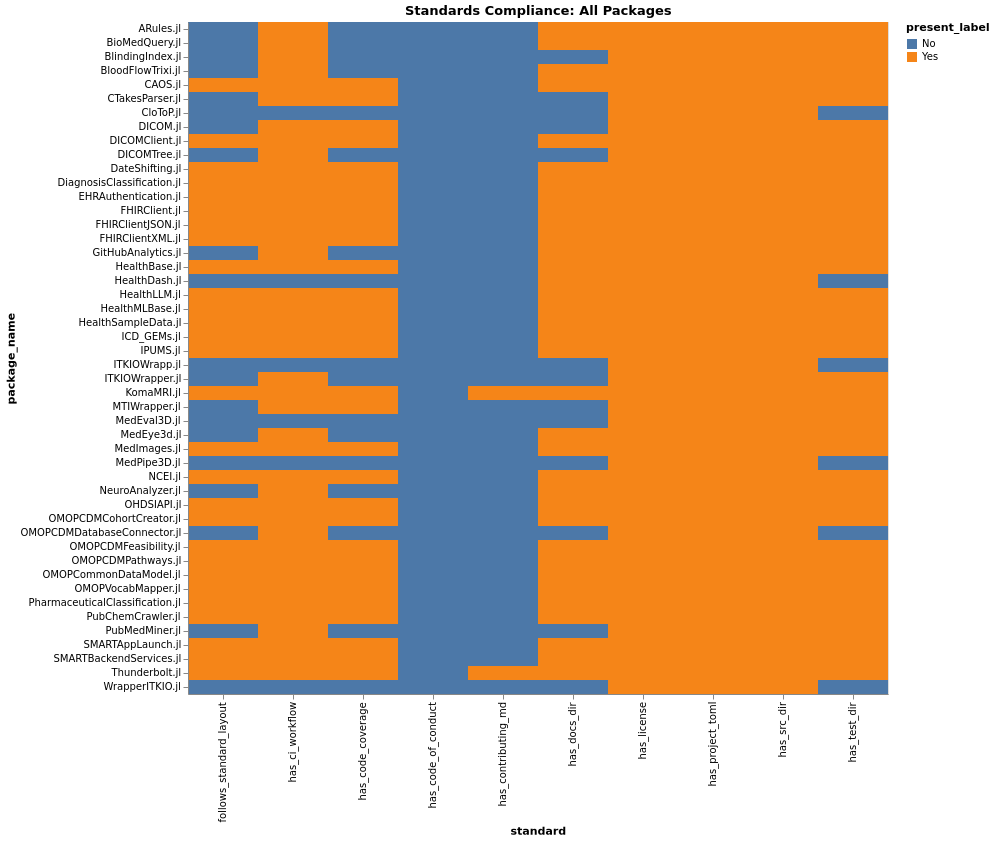

#### Standards Percentages

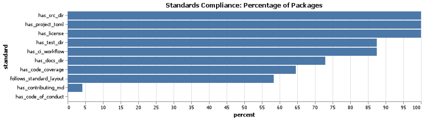

#### Style Guide Distribution

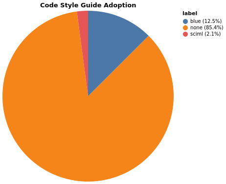

**Packages Following Blue or SciML Style Guides:**

| Package | Style Guide |
|---|---|
| KomaMRI.jl | Blue |
| HealthSampleData.jl | Blue |
| Thunderbolt.jl | SciML |
| OMOPCDMFeasibility.jl | Blue |
| OMOPCDMPathways.jl | Blue |
| HealthLLM.jl | Blue |
| IPUMS.jl | Blue |

#### Maturity Tiers

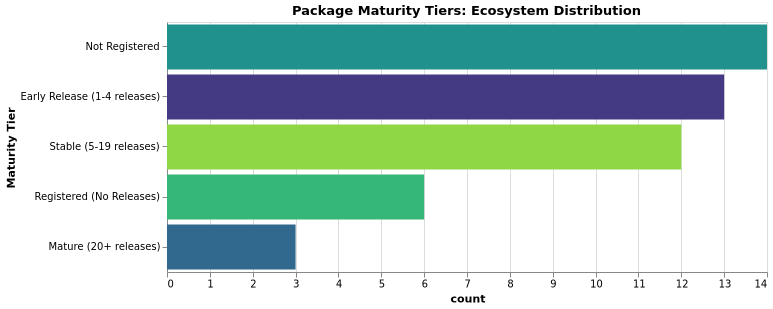

| Tier | Criteria |
|---|---|
| Mature | In General Registry; releases_count ≥ 20 |
| Stable | In General Registry; 5 ≤ releases_count ≤ 19 |
| Early Release | In General Registry; 1–4 releases |
| Registered (No Releases) | In General Registry; releases_count = 0 |
| Not Registered | Not in General Registry |

#### License Presence & Types

All JuliaHealth packages have licenses -- 100% license compliance! This is an important ecosystem signal showing professionalism and legal clarity.

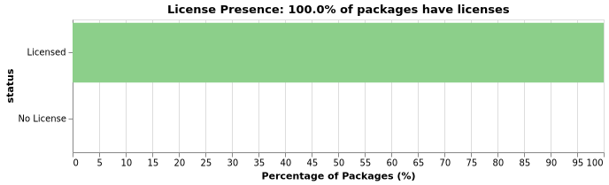

License types vary across the ecosystem. The most common licenses include MIT, Apache-2.0 and BSD variants, reflecting standard open-source practices:

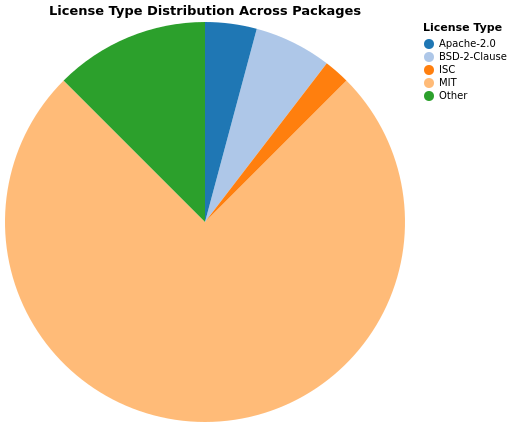

#### Non-Package License Coverage

Non-package repositories also show strong license compliance:

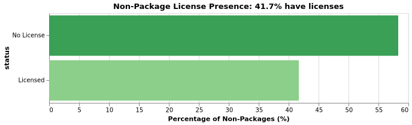

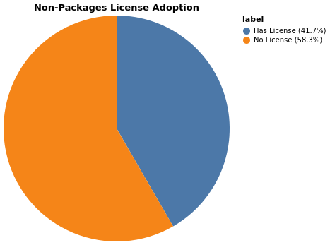

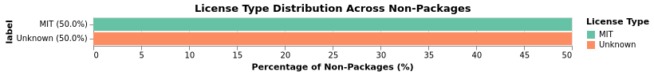

Non-package repositories missing a LICENSE file:

- JuliaHealthEcosystemPaper
- JuliaHealthWebsiteOld
- JuliaHealthZoo
- MedPipe3DTutorial
- ObservationalHealthSubecosystemPaper

### Activity, Releases & Engagement {#activity-releases-engagement}

Community engagement and maintenance activity indicate package health. We analyzed activity recency, releases, stars, contributors, and popularity.

#### Activity Recency

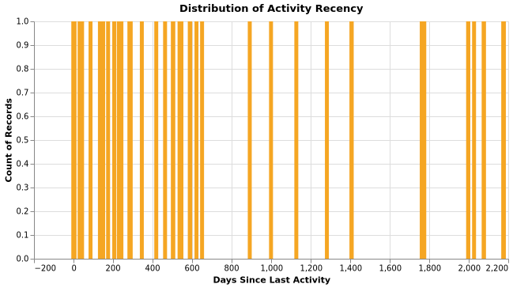

#### Releases Distribution

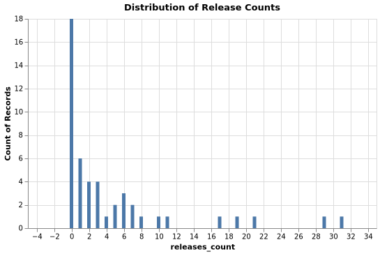

#### Stars Distribution

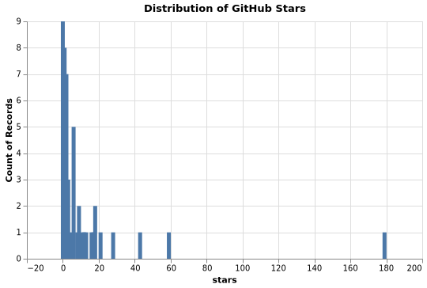

#### Contributors Distribution

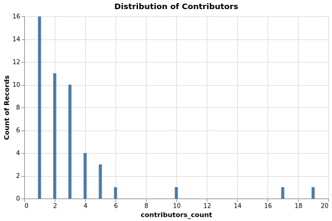

#### Top Packages by Stars

#### Top Packages by Contributors

#### Top Packages by Releases

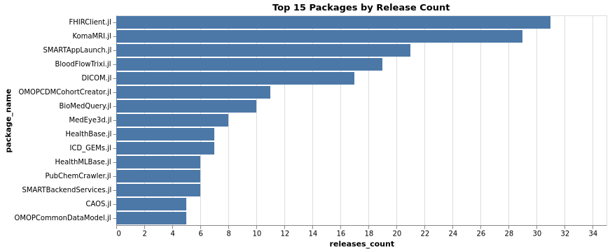

#### Non-Package Stars and Contributors

### Issues & PR Health {#issues-pr-health}

#### Issues Comparison (Packages)

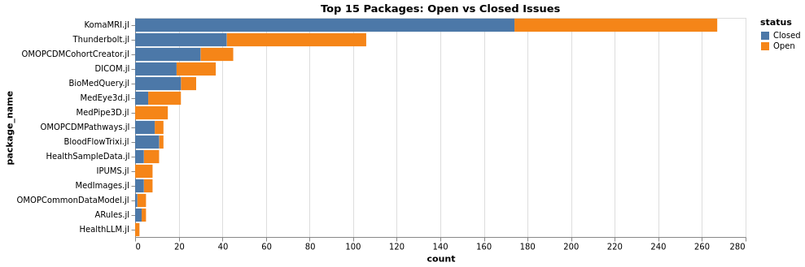

#### PRs Comparison (Packages)

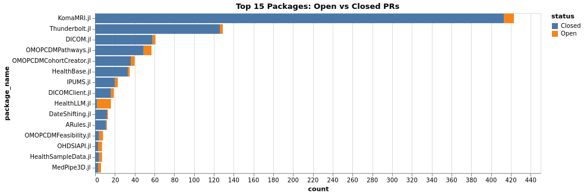

#### Issues Comparison (Non-Packages)

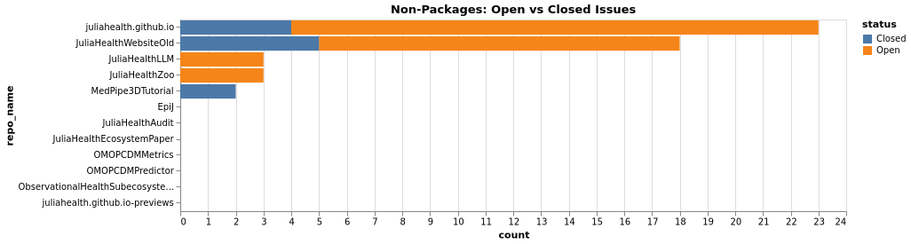

#### PRs Comparison (Non-Packages)

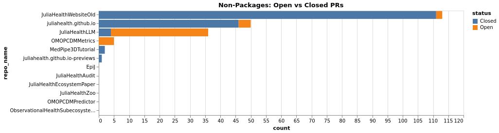

### Contributors (Cross-Ecosystem) {#contributors-cross-ecosystem}

Human contributors across all JuliaHealth repos (bots excluded). `total_contributions` sums all contributions across repos; `num_repos_contributed` counts distinct repos touched.

#### Top Contributors by Total

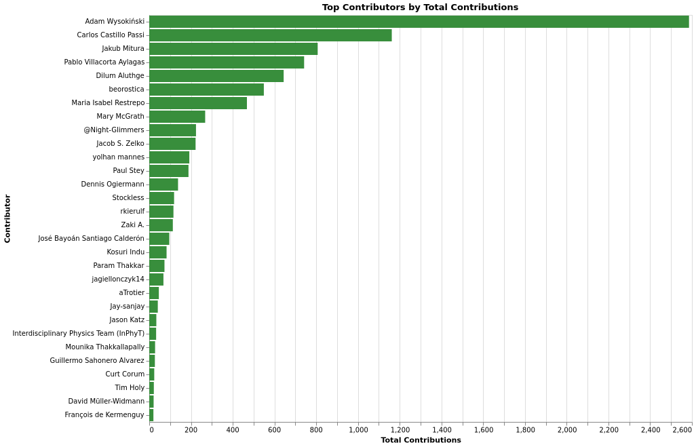

#### Top Contributors by Repo Count

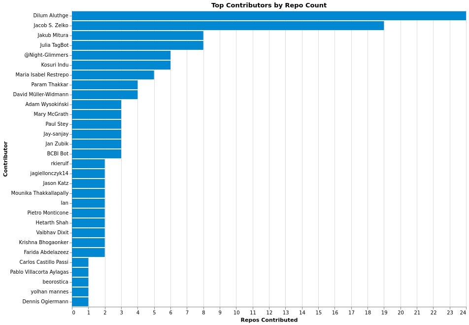

#### Contribution Distribution

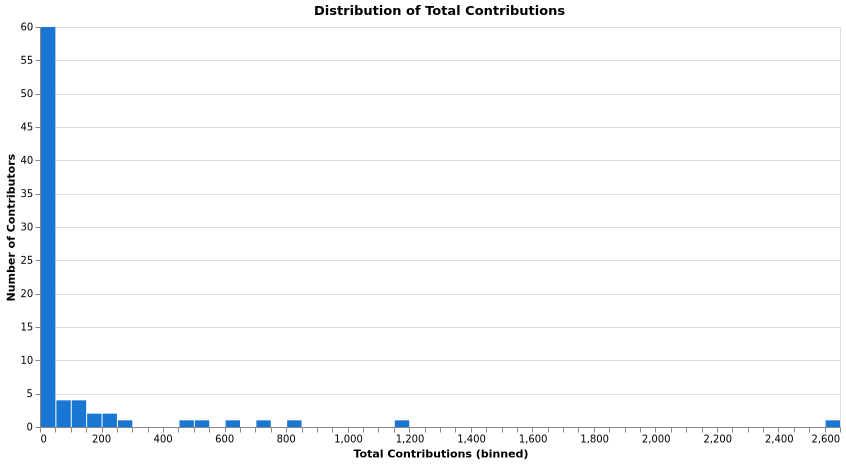

#### Engagement Tiers

| Tier | Rule (total_contributions, num_repos_contributed) |
| --- | --- |
| Core | total > 500 or repos > 10 |
| Regular | total ≥ 100 or repos ≥ 3 |
| Occasional | total ≥ 10 or repos ≥ 1 |
| One-time | Otherwise |

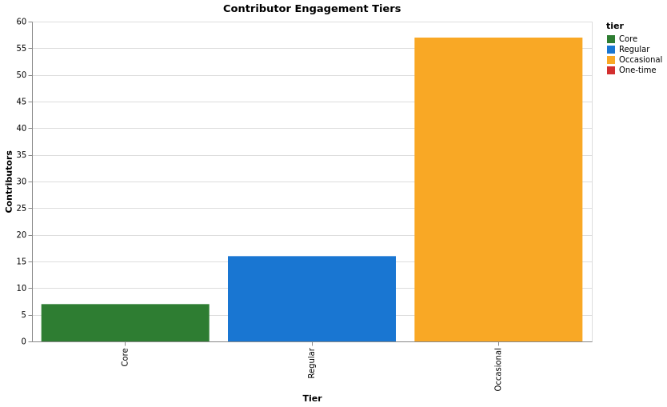

## Actionables

Looking at our findings, here are concise, prioritized actions organized in the updated categories. Each item is phrased as a small, actionable task that can be addressed in a single PR or issue.

### Documentation & README

- **Rationale:** Good documentation makes it easy for users to learn and use the package. Good docs also help contributors get started and contribute safely.
- **Actions:**
  - Deploy `docs/` to GitHub Pages.
  - Add a short `CONTRIBUTING.md` and a `CODE_OF_CONDUCT.md`.
  - Add a well-defined example and description with a code block to the `README`.
  - Use `Documenter.jl` to build docs when appropriate.

### CI/CD, Testing & Coverage

- **Rationale:** CI runs tests automatically to find bugs early. Coverage helps identify parts of the code that need more tests.
- **Actions:**
  - Add a GitHub Actions workflow that runs tests and builds docs.
  - Enable coverage reporting and add a coverage badge (codecov) to the `README`.
  - Add `test/` for key functionality.

### Structure, Licensing & Maturity

- **Rationale:** A standard layout makes packages easier to install and use. Published releases and clear licensing let others depend on stable, compliant versions. A shared code style reduces trivial review comments and confusion, and CI checks catch obvious issues before human review.
- **Actions:**
  - Finalize a standard template for package structure.
  - Publish a release and register in the General Registry if ready; fix registry metadata if needed.
  - Adopt `JuliaFormatter` and add formatting to CI.
  - Add basic lint or build checks to CI (e.g., docs build, tests pass).

### Activity, Releases & Engagement

- **Rationale:** Clear labels and simple guides help new contributors find tasks. Public maintainer info makes it easier to coordinate work and handoffs.
- **Actions:**
  - Add `good first issue` and `help wanted` labels and link them to `CONTRIBUTING.md`.
  - Add a `MAINTAINERS.md` or contact/triage instructions in the `README`.
  - Open an issue for inactive packages proposing archive, transfer or handoff steps.

### Issues & PR Health

- **Rationale:** Well-triaged issues and reviewed PRs keep backlog healthy and contributors unblocked.
- **Actions:**
  - Use the issue/PR comparisons above to prioritize triage and reviews.
  - Apply `good first issue`/`help wanted` labels to surface approachable work.

### Contributors (Cross-Ecosystem)

- **Rationale:** Recognizing and engaging active contributors helps sustain momentum across repositories.
- **Actions:**
  - Use the generated lists in [data/results/lists](data/results/lists) to pick concrete targets and open issues or PRs against the repositories listed.

## Conclusion

The JuliaHealth ecosystem is growing and has a strong foundation. Most packages follow good practices like CI/CD automation and General Registry registration. We have excellent examples like KomaMRI.jl that show what well-maintained packages look like. But there's room for improvement. Some packages lack documentation, contributing guidelines and code of conduct files. Some valuable packages have become inactive and need new maintainers.

The good news is that every gap we identified is an opportunity to contribute. This audit is just the beginning. The goal is to make JuliaHealth more accessible so new members can easily discover packages, understand how to use them, and contribute improvements.

If you want to get involved, check out the audit repository, browse the detailed findings and pick something you'd like to work on. The JuliaHealth community is friendly and supportive. Reach out on Julia Slack (#health-and-medicine) or Discourse if you have questions. Let's work together to make JuliaHealth even better ❤️.

## Acknowledgements

This work was made possible by the **NumFOCUS Small Development Grant** program. Thank you to NumFOCUS for supporting ecosystem health and community sustainability. Special thanks to my mentors: **Carlos Castillo Passi** and **Jacob Zelko (TheCedarPrince)** - for project guidance, technical mentorship and insights into the JuliaHealth ecosystem

**Thank you to:**

- The **JuliaHealth community** - Over 300 members across Slack, Zulip, and Discourse who make this ecosystem welcoming and collaborative
- All **package maintainers and developers** - For building and maintaining the tools that make this audit possible
- The **Julia community** - For creating an amazing language and ecosystem

_Note: This blog post was drafted with the assistance of LLM technologies to support grammar, clarity and structure._
