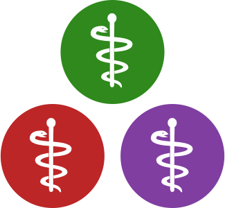

<!-- ALL-CONTRIBUTORS-BADGE:START - Do not remove or modify this section -->
[](#contributors-)
<!-- ALL-CONTRIBUTORS-BADGE:END -->

<div style="text-align: center;">
  <span style="font-size: 4ch; font-weight: bold; margin-top: 0.3em;">
    JuliaHealth
  </span>

  <em>
    Transforming Health Research! Improving medicine, health and bio-medical research using the power of Julia
  </em>
</div>

---

### Local Development

```sh
quarto preview . --port 3000 --no-browser
```

### Quarto API reference

https://quarto.org/docs/reference/

### Possible Future color scheme?

https://coolors.co/fefeff-c74042-bc2021-803ba1-b690ca-6cad5f-2a8a14

## Contributors ✨

Thanks goes to these wonderful people ([emoji key](https://allcontributors.org/docs/en/emoji-key)):

<!-- ALL-CONTRIBUTORS-LIST:START - Do not remove or modify this section -->
<!-- prettier-ignore-start -->
<!-- markdownlint-disable -->
<div style="display:flex; flex-wrap:wrap; align-items:center;">
  <a href="https://jacobzelko.com" title="Jacob S. Zelko">
    
  </a>
</div>

<!-- markdownlint-restore -->
<!-- prettier-ignore-end -->

<!-- ALL-CONTRIBUTORS-LIST:END -->

This project follows the [all-contributors](https://github.com/all-contributors/all-contributors) specification. Contributions of any kind welcome!
